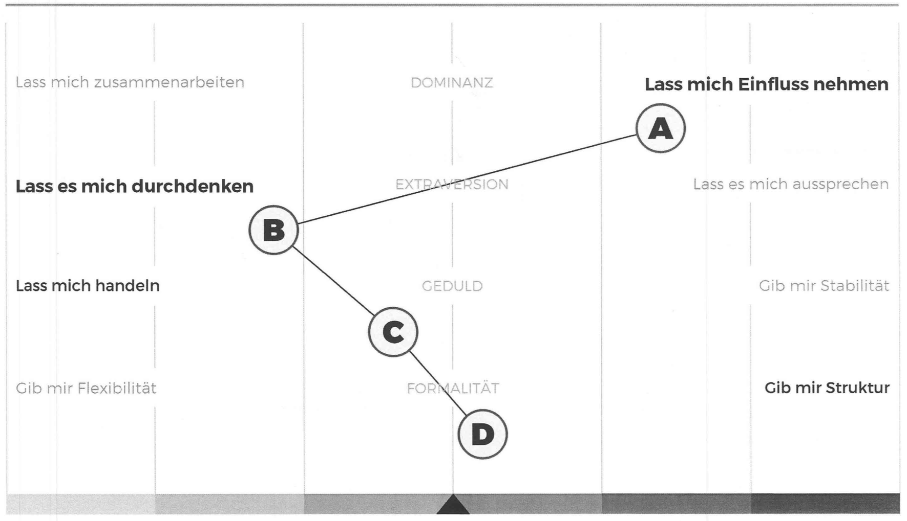

# Manual About Myself™️ 🧀
Hi. My name is David Werner. I’m an engineering leader and consultant. I currently work as an Engineering Directory at XING, previously as a Technical Product Lead at InnoGames. I did freelance work before that for more than ten years. I am coming from a strong backend-leaning technical background and did most of my projects in PHP and Java.

I am managing, building and growing teams for many years now. I champion engineering best-practices and have a distinct emphasis on software quality, Continous Integration, and automation tools.

## What is this document?

Let’s face it; this is a weird document. But this could be your manual on how to work with me. Its sole purpose is to help you understand me and my intentions better, but it also helps me self-reflect on my style. When you are my direct, it will give you something to read about me, so we can have better and more meaningful conversations about what’s important. I took some nicely worded phrases from other managers because I felt that these match my beliefs quite well.

# How I like to work

I love to be surrounded by people who challenge me, and I recognize that most people are better at something than I am. That’s probably also the reason why I hired you. I am not aiming towards being the best engineer in our organization. You are the expert, you code, build, test, ship, create processes and lead the way. I’m here to help. My best case scenario is when I can get out of your way.

I value open, authentic relationships. I promise to be kind, honest, empathetic and friendly with you. I want to get to know you and what's important for you. I will try to create a safe space for you to flourish and grow.

**How I like to communicate**

Precise, gentle, honest communication. I try not to leave you guessing what I ‘really’ think or expect you to read between the lines of what I’m saying. But I know I can still improve on this. In the past I got the feedback to have a “Manager Gameface” and people have a hard time to read me and understand what I was saying. It’s not intentional. So, if it’s not clear, and you have a nagging feeling, let me know so I can fix it!

I will be in a lot of meetings, but I will try to carve out enough time to be responsive to the teams. Because of that, I prefer async communication, unless it is an emergency. This also goes for sensitive or very important dialogue, please to the in person. I’ll try to reply promptly to you or let you know when you can expect a reply if you reach out.

> email > slack > text > in-person/meeting > call

I expect you to communicate ideas, problems, and solutions effectively. I will make decisions and move communication up and across the chains based on the information you are providing, so better make sure it's correct.

I groom my calendar very well. And usually, my schedule is not super full. I’d like to have it that way intentionally so that I can have some quality time with the teams. Blocking some time on my calendar is the best way to get my undivided attention. If you invite me to a meeting, include the topic and agenda. If you need “just two minutes to talk about something”, make sure I know about what item or problem you like to talk about. Otherwise, I might assume it is something unfortunate. But keep in mind: My calendar is not a puzzle. If you try to squeeze in 15 minutes between two meetings I might decline it or turn up stressed (running from meetings back-to-back is no fun).

Also: I am sometimes on Slack in the evenings after the kids go to bed or I will answer emails on the weekend. I do not expect you to do the same. If you need something, push your communication pro-actively, do not wait for me to pull.

In general, please over-communicate with me. Don’t worry about sending me too many messages or overwhelming me; it’s precious. Since I manage different teams in different units,  I’d love to be there for you if something comes up. Please understand that I can’t see how you’re doing by walking around the office.

**Talking about solutions**

It is crucial to me that you try to focus on possible solutions to a problem. The focus on the answer gives us the right mindset to talk about possible paths to a solution, rather than only focussing on what's wrong or not working right now.

How I like to do it: I don’t require you only to approach me when you have the perfect solution, but I’d like you to think about some options before. It doesn't have to be perfect, but should be a reasonable basis for our discussion. The ideal way will be if you prepare a decision proposal on how to move forward. It could look like this:

- **Option 1 (preferred):** Describe what you are planning, what implications there are and what the pros/cons are. Have a specific impact on business value and what KPIs are affected. Be prepared to provide insight and clarity to the options you propose.
- Option 2: …
- Option 3: …

**Status Reporting**

When it comes to reporting your progress or status of your assignments and your professional behaviour, I’d like to follow a Red-Amber-Green assessment model. It looks like this:

  **Green** - there might be things to improve, or there might not. It means you are on the right track (in budget, time and quality and scope) and don’t need any further support.

  **Amber** - there are one or more issues that, if left unchecked in the long term, will not be sustainable. Something needs to change. You might need help with that, or you are blocked with your assignments. I leave it up to you to determine if you need help with that or not. I will only step in if you cannot find a solution, if you request my assistance or if you have reached an impasse.

  **Red** - there is a significant problem, and we need to talk about this explicitly. Possible approaches to solving this problem should come with a proposal and timebox attached.

The goal with this reporting tool is that we establish transparency regarding the status of our projects. Please report your status pro-actively. Choose the format that fits your needs best. For example: If Green, therefore not urgent, talk about it in our 1:1s. If Amber, inform via Mail or Slack. Then I have the chance to react appropriately. If Red, schedule some face-time with me. That way I can make suggestions and help you directly. If you ever feel you don’t know where you are at, how to move forward, feel unsafe or missing input and feedback, please ask me.

**D.R.I. Principle**

I am a believer in the **D**irectly **R**esponsible **I**ndividual principle and self-organizing teams. I like knowing who is driving which topic and who I can approach for action items after a meeting. By seeking to create a culture of accountability with the group, we avoid dependencies on managers to tell the team what to do and increase responsibility on the team to self-organize. If you want to learn more about it:

- [Directly Responsible Individuals](https://medium.com/@mmamet/directly-responsible-individuals-f5009f465da4)
- [How Well Does Apple's Directly Responsible Individual (DRI) Model Work In Practice?](https://www.forbes.com/sites/quora/2012/10/02/how-well-does-apples-directly-responsible-individual-dri-model-work-in-practice/#778921f3194c)

# North Star Principles
    “*The way to make people trust-worthy is to trust them.”*
      — Ernest *Hemingway*

Regardless if you are an engineer, a people manager or act in a different role. When you report to me, there are some principles and expectations we should talk about.

The base for everything we do, our interaction, our communication, your commitment, and my guidance is **trust**. I want to start a dialog with you, so please tell me if I mess up. I am willing to listen if you keep your feedback fair and on a constructive level.

## My leadership philosophy

I believe in leading by helping others see more clearly what they already know, supporting them in finding solutions and fostering the strengths that they already own.

**1:1s**

I will create a meeting individually with you (and everyone else from my direct reports) on a weekly basis. We'll call these meetings "one-on-ones". I think this is an excellent way for us to maintain good, open communication, and continue to build our relationship. We'll be meeting for 30 minutes once a week, at a pre-scheduled (and usually unchanged) time. It will be a private conversation - just you and I. We'll meet at my desk - if you have concerns, we'll talk about those once we get going. I will probably have some things to discuss with you, but this is first and foremost an opportunity to let me know how you're doing.

Stuff we might be talking about:

- How you are doing and how you feel.
- Things I heard, some context from the greater organization.
- Some feedback I want to share with you.
- Talk about your career progression.
- Please proactively tell me if your spidey sense is going off about team dynamics, an individual, or something else that may eventually grow into a significant concern.
- Offer help to help you work through problems you’re trying to solve.
- I also like to share some of my current topics and questions I am working on, so you also have some concrete information about what I’m up to.
- Encouraging and modeling a healthy work-life balance and avoiding burnout.

That means that you drive the agenda. For me, it is fine if you want to do reporting, but the general idea is that you share what you need. Let’s talk about what you wish could be different, how you feel about our team and your peers, what your career goals are. This discussion will also give me a chance to share feedback and coaching with you on things you're trying to improve on. Remember, you drive the conversation and the agenda.

**Feedback**

Giving feedback on your performance and behavior is a key part of my responsibilities. To be effective in providing and getting feedback, you should get comfortable with that process. But don’t worry - we both will have enough time to train that. What you can rely on: If I'm worried about your performance, I will let you know. But if you worry that I'm concerned about your performance, please also let me know.

As an analogy to giving feedback, I often refer to the “brick method”. When you drop a brick on your foot, it hurts immediately. It doesn’t hurt a month later or when you have the next yearly appraisal talk. Same goes for feedback. It should be fast and describing a specific behavior. Also, it should be small enough to handle and steer you in the right direction.

Imagine a road, the flattest and smoothest road you can think of. Even on this road, when you let go of the steering wheel, you will end up on the side of the road at some point. Feedback is like the little corrections you do when driving. These are not significant corrections; you don’t wait until you are almost in a ditch. You do these small corrections often and in best-case even more or less automatic. This goes for any positive feedback, as well as for things you can improve (or “negative” feedback).

I aim for “no surprises in our performance dialogue meetings”. That means that you should get quick feedback and should have heard about it at least once. There is no use in “4 months ago, you did this and that”.

Feedback doesn’t hurt, I will be our tool to get better in what we are doing. But I know that I will make mistakes, and I'm going to make decisions that are wrong. I promise you that if you come to me and you explain to me why something is wrong, I will listen, and I will try to fix it.

**Coaching**

    *“If the ladder is not leaning against the right wall, every step we take just gets us to the wrong place faster.”*
      — Stephen R. Covey

Many people don’t understand what coaching means. I don’t claim that my approach is the perfect one. Admittedly, I also know that I can still improve on this topic. But I know what it’s not: We will not lock ourselves in a room for hours, and afterward, I tell you what your next career step is. Coaching can be really easy or very hard for us. It usually doesn’t take up more time than 5 minutes per week and can happen within our 1:1s. If you actively manage your career, it’s easy. If not, this will be no fun at all.

I expect you to take your career planning into your own hands, again, it is your responsibility. I have a strong background as an engineer, but you are much better qualified to come up with ideas in that area.

I can help you with reflecting and brainstorming on the next steps. For a given topic, if you want advice and NOT coaching, please explicitly ask for it - just let me know that that’s what you need. I encourage you to be as open as you can be, and over time I bet we both will get more comfortable.

If you ever heard of S.M.A.R.T. goals - great! I think they don’t work. When we talk about your personal development plan, let’s focus only on M (measurable) and T (time bound). It gives us something very focused to work and improve on.

**Delegation**

I am accountable for the decisions the team makes, even if I’m not the one making these decisions most of the time. Also, most of my own performance reviews are based on my team's performance, not so much on my individual performance. Because of that, delegation is an indispensable part of my work. If you are successful and happy, our team is successful and happy, and I am successful and happy.

But sometimes I might put more on your shoulders that you think you can handle. That’s intended. That’s one way of figuring out where your strengths and limits are.

## My expectations for everyone who reports to me

Additionally and partly overlapping to the text above

- Get results. Do your job. This is your first and primary responsibility.
- Make mistakes, but learn from it.
- Be honest, even if it makes you look bad. Don’t cover up.
- Establish your self some good sense of quality awareness, go for automation if possible.
- Build an understanding of the product you are building, think about Business Value.
- Communicate effectively and frequently.
- Think cross-functional: Engineering, Agile Processes, DevOps, QA, Infrastructure, and Performance Engineering. Don’t shy away from what you feel is out of your “comfort zone”.
- Engage in knowledge sharing: share what you learned with your peers, engage in mentoring and give talks and workshops.

**Please**

- Please reach out and tell me if anything, at all, feels off. It’s so much harder to solve problems when I’m guessing what they are. I’ll never consider that proactively speaking up about challenges as a sign of complaining.
- I value hearing your honest, transparent thoughts about how we can learn and grow together. Bonus points - Thinking about solutions/approaches to the challenges you bring up (I understand this isn’t always possible, and sometimes even when the challenge is unclear).
- Please invest in yourself and engage in self-improvement. This looks different for everyone; I can help if you need a direction.

**Remember**

- You are the expert (be a better developer than me, if you aren’t already).
- Own your work (you build it, you ship it!).
- Form your own opinion and be able to voice it.
- Own your career path.
- Be prepared to provide insight and clarity to all the decisions you make.
- If you don’t understand something, or how it fits into the larger picture, ask!
- Tell a story. Explain your plan. That helps me understand where you are coming from.
- Have a laser focus on the essentials and what's important.
- Be open to critical feedback.
- Love your craft, not your code.
- You own the 1:1’s, they are for you, I’ll manage the timing
- Show up. Show up and keep showing up. Show up with at least enthusiasm as you had when you first raised your hand to volunteer. The volunteering part is easy. Making promises is a fun way to get someone's attention. Keeping those promises is often unsung, but that's how you build something.
- Be on time. Call me if you are late. Tell me if you can't make it.
- Push yourself to try new things and continue to engage in learning and knowledge sharing.

## My expectations of managers who report to me

It is quite ‘easy’ to be a good manager. If you do the following things, then you are already better than 90% than others:

- Again: Get results. Do your job. This is your first and primary responsibility.
- Stick up to your commitments.
- Communicate often and pro-actively, ask questions.
- Focus on hiring. Hire people that are better than you.

**People Management**

Embrace your key responsibilities of managing a cross-functional, multi-cultural engineering team. Develop the people, use their unique skills and coach them on personal and tech topics.

- Please have weekly 1:1s with your direct reports. In those 1:1s, please be explicit about your reports’ career progression, the feedback you have for them, the context from the greater org as you have it, and coaching as they work through problems. You can also expect regular “skip level” 1:1s where I’ll chat with your direct reports.
- Please demonstrate a healthy work-life balance to your team. Please do not send emails/Slack messages far outside of work hours to your team; if you do need to for some reason, please make it clear to your team that it’s an unusual circumstance.
- Hiring is probably the most crucial job of yours. It is better to leave a position open than to hire a person that is wrong for the position. Assemble the best team possible.
- Develop a high empathy and understanding of the needs and personalities of people who report to you.

**Leadership**

Establish a good communication system, set the direction, inspire people, promote our company values and purpose, and shape the tech strategy.

- Foster a culture of knowledge sharing within your team and interfacing teams.
- Please routinely reach out to your team’s stakeholders. Keep an ear to the ground about what they’re launching, and be proactive about responding to them when they reach out.
- Please build a peer network for yourself inside and outside of our company. I’m happy to help you find new peers to build that network. Please lean on them, as you explore solutions to the challenges you face.
- Please continue to educate yourself on management and leadership: use your yearly training allotment, attend Leadership & Development workshops and conferences, learn from peers, and come up with own ideas.
- Make sure you know the role description and responsibilities of your direct, teamlead role, director and VP.
- Act professionally when you need to implement a decision that you disagree with. Understand that you are the company for your directs and that you have a big red “BOSS” sign on your forehead. You are obligated to move forward and communicate decisions made by the organization or me, even if your recommendation wasn’t chosen and you pitched something else with your directs.

**Driving things & Company Strategy**

Act on the company strategy and help the company grow.

- I expect you to take the reins of ownership, and all that entails, in everything you drive. That also means that you also own all of your successes.
- Building scalable processes, technology and organization (first) business (2nd).
- Get yourself familiar with our companies values as well as with our leadership codex.
- Remember that you can only “juggle” that many topics. If you start taking on more topics than you can “juggle”, you will start dropping some of them. The best managers I have met so far were able to handle two big topics at the same time. Not more. Focus and deliver, then take on additional tasks when you are done.
- I love tools. I love automation. If you can show me a great tool that will increase our performance or understanding of our code, it’s very likely that I will agree to give it a try. I am also a big fan of monitoring solutions that warn us before something happens and provides us with an insight into what could happening in our production environment. I expect from you that you develop and plan our monitoring and alerting solutions, both technically and culturally.

## Some controversial positions

Feel free to challenge these positions and talk to me about it.

**I expect you to help me with my goals**

We are successful together. But in contrary to what you might read elsewhere, I don't believe that managers work only for their employees. I see it more this way: we share the same goals. I help to split up the packages and share the workload equitably. I have the higher purpose in mind (the “lighthouse” for you to aim for) and will help you get the direction right. But you do the rowing. I gladly share the goals I have for the team and the org in a technical vision discussion. The best way to move forward with personal and organizational goals is to be aligned and heading in the same direction.

**High agreeableness vs. low agreeableness**

I tend to be a “highly agreeable” person. That neither something good or bad. The positive side is, that I usually have a very high empathy for your challenges and requests, I listen carefully and try to support you. The downside is that I might not always come straight to a point, especially when it comes to negative feedback. I’m working on that. If you have the feeling that I am holding back some feedback, tell me. I also can be very blunt when directly requested.

**My door is not always open**

My door as a manager doesn't have to **always** be open. More often than not, yes... but it's okay to say no to impromptu requests.

**Be imperfect**

If you need to be perfect, it's hard to press the “ship it” button. Difficult to hire someone who makes things happen (because you'll be responsible for what happens). Frightening to put yourself into a position where you're expected to introduce new work. The only way is forward. Forward moves us from what we have now (perfect, or at least we're no longer living in fear of what's not right) to a world filled with nothing but imperfection. If you want motion, the only way is through. We get to the work we seek by passing through imperfection.

**How do you notice that I am grumpy**

It happens. I also get stress or annoyed from time to time. Usually, you notice this when I get reserved (yes/no answers), lose my humor or stop laughing about bad jokes. Also, I will be less frequently at my desk in the team space to get some space or fix stuff that is burning down.

# Read on

On our journey to improve, it’s vital to learn a lot and engage in building knowledge. I read a lot about management and leadership. Some of this is also applicable to the engineering field. Here are some pointers on where to start. I’ll add more to this list from time to time.

**Engineering**

- Software Engineering Radio (Podcast): [http://www.se-radio.net/](http://www.se-radio.net/2008/09/episode-110-roles-in-software-engineering-i/)
- [The Effective Engineer](http://www.effectiveengineer.com/)

**Leadership & Management**

- Manager Tools (Podcast): https://www.manager-tools.com/
- [Managing Oneself](https://www.goodreads.com/book/show/2477223.Managing_Oneself) -  A classic in your library.
- [Radical Focus](https://www.goodreads.com/book/show/28951428-radical-focus) - by Christina Wodtke
- [Leadership Lessons](https://www.goodreads.com/book/show/19825163-leadership-lessons-from-peter-drucker?from_search=true) - By Peter F. Drucker
- [The Five Dysfunctions of a Team: A Leadership Fable](https://www.goodreads.com/book/show/21343.The_Five_Dysfunctions_of_a_Team) - by Patrick Lencioni

**Career and Business**

- [The Prince](https://www.goodreads.com/book/show/28862.The_Prince) - by Niccolò Machiavelli, another classic.
- [The 7 Habits of Highly Effective People: Powerful Lessons in Personal Change](https://www.goodreads.com/book/show/36072.The_7_Habits_of_Highly_Effective_People) - by Stephen R. Covey
- [Start with Why: How Great Leaders Inspire Everyone to Take Action](https://www.goodreads.com/book/show/7108725-start-with-why) - by Simon Sinek
- [Getting Things Done: The Art of Stress-Free Productivity](https://www.goodreads.com/book/show/1633.Getting_Things_Done) -  by David Allen

**Everything else**

- [Essentialism: The Disciplined Pursuit of Less](https://www.goodreads.com/book/show/18077875-essentialism) - Stop being busy, focus on what’s essential.
- [BulletJournal](http://bulletjournal.com/) - An analog GTD system
- [Impact Mapping: Making a Big Impact with Software Products and Projects](https://www.goodreads.com/book/show/16084015-impact-mapping)
- My old freelancing page is still online, in case you are interested: https://wernerbros.eu/

This is my [PI](https://www.predictiveindex.com/what-we-do/our-assessments/behavioral/) from when I started XING, might be interesting for you to align with yours (sorry, german only)

**Appendix**

In [here](appendix.md) you will find some additional and maybe motivating ideas that didn't fit somewhere else.

### Sources

- [Molly's Manager Readme](https://github.com/molly/manager-README)
- [12 “Manager READMEs” from Silicon Valley’s Top Tech Companies](https://hackernoon.com/12-manager-readmes-from-silicon-valleys-top-tech-companies-26588a660afe)
