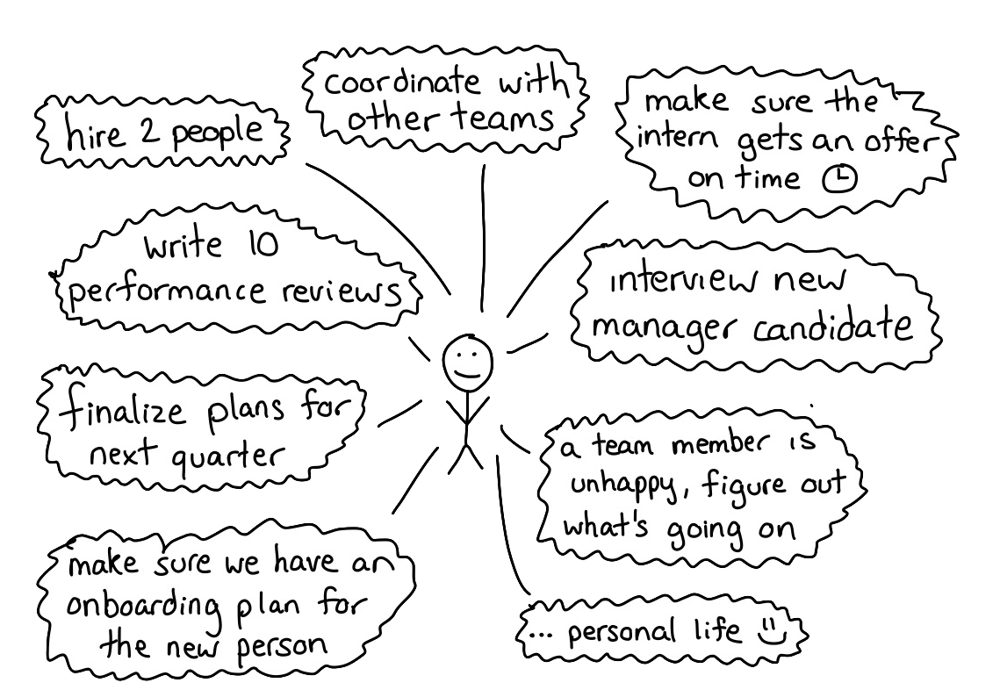

footer: David Werner, Introduction
slidenumbers: true
autoscale: true
build-lists: true

# David Werner
## Engineering Leader

^
This document is meant to be used as an introduction for myself. It can be rendered using https://www.deckset.com.

---

# That's me

- Living in Hamburg, two kids
- Engineering Director @ [XING](https://www.xing.com)
- Before: [InnoGames](https://www.innogames.com)
- Freelancer > 10y
- Technical background: PHP, Java

^
This is me. I am usually a somewhat private person, but now you got the chance to ask me (almost) anything. We'll learn more about each other organically, but let's give this a quick start.

---

# My Job

- Give my teams context from the greater org
- Hiring the best people for the job
- Remove obstacles and moderate

^
The be fair, every Director in this company is living their role a bit different.

---

# How I like to work

- email > slack > text message > in-person/meeting > call
- Talking about solutions
- Status Reporting: Red, Amber, Green

---

# North Star principles

- Trust
- Regular 1:1s
- Direct feedback
- Coaching (to a point)

^
This represents how I work, what you can rely on and also where to hold me accountable for.
We get efficient when we base or work on trusting each other. This is why we should start building this trust first.
1:1s and feedback are a tool to drive that. You can also expect direct feedback from me. I will coach you, but you have to own your career and push the agenda on this.

---

# Manager "GameFace"

- Hard to read
- Sometimes, I am not clear enough
- It’s not intentional
- Ask

^
In the past, I got feedback that I am sometimes hard to read. If you don’t understand something, or how it fits into the larger picture, ask!

---
# I am only human

---

^
Sometimes I fall into a trap where I think my manager should be able to solve EVERY problem on the team and if they're
not then they're not doing their job. It's helpful for me to remember that at any given time they're probably dealing with a lot!

---

# Thanks
## Questions?
