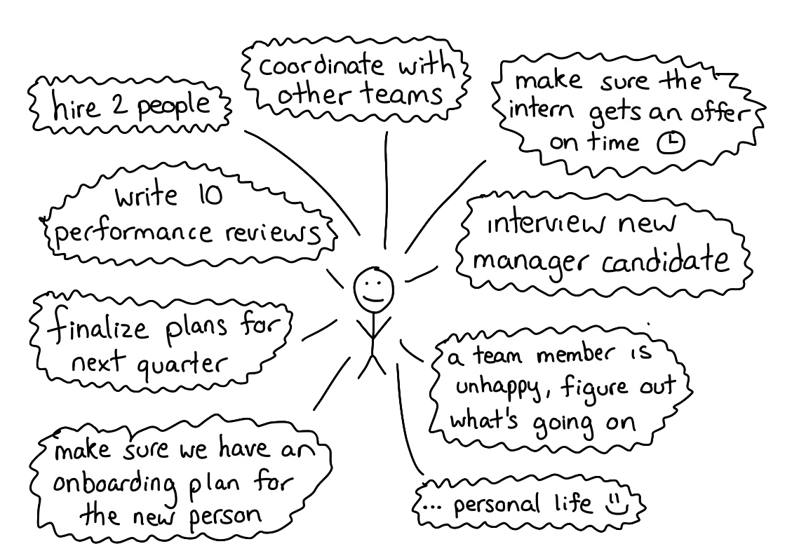

footer: David Werner, Introduction
slidenumbers: true
autoscale: true
build-lists: true

# David Werner
## Engineering Leader

^
This document is meant to be used as an introduction for myself. It can be rendered using https://www.deckset.com. Some pictures by Julia Evans from her "Help! I have a manager!" Zine.

https://jvns.ca/blog/2018/09/22/new-zine--help--i-have-a-manager/

---

^
I've been working as a engineer for more for 10 years and I've had several managers. When I started out, I didn't really understand my manager's job or how to work with them.
Since then, I've had some GREAT working relationships with managers and a few less good ones. Having a good relationship with my manager is the most important factor in my happiness at work.

---

# That's me

- Living in Hamburg, two kids
- Engineering Director @ [XING](https://www.xing.com)
- Before: [InnoGames](https://www.innogames.com)
- Freelancer > 10y
- Technical background: PHP, Java

^
This is me. I am usually a somewhat private person, but now you got the chance to ask me (almost) anything. We'll learn more about each other organically, but let's give this a quick start.

---

# My Job

- Give you context from the greater org
- Hiring the best people for the job
- Remove obstacles and moderate

^
The be fair, every Director in this company is living their role a bit different.

---

---

# Your Job

- Get results
- Make mistakes (but learn from it)
- Be honest, even if it makes you look bad
- Build an understanding of the product you are building
- Communicate effectively and frequently
- Think cross-functional
- Share your knowledge

^
- Get results. Do your job. This is your first and primary responsibility.
- Make mistakes, but learn from it.
- Be honest, even if it makes you look bad. Don’t cover up.
- Establish your self some good sense of quality awareness, go for automation if possible.
- Build an understanding of the product you are building, think about Business Value.
- Communicate effectively and frequently.
- Think cross-functional: Engineering, Agile Processes, DevOps, QA, Infrastructure, and Performance Engineering. Don’t shy away from what you feel is out of your “comfort zone”.
- Engage in knowledge sharing: share what you learned with your peers, engage in mentoring and give talks and workshops.

---

# Understanding goals and priority

---

^
They might be asking for metrics because:
1 they're hearing complaints about X being slow (that you might not be hearing!)
2 without metrics, it's hard for them to have an informed conversation about those complaints (& defend you if X is actually fastr )

---

^
Having regular conversations about their priorities for the team is SO USEFUL and means that I'm
surprised less often

---

# How to work well with your manager

---

---

^
Basically your manager's job is to make sure that your team is getting work done that will help the business. Communicating well can help you:

---

# How I like to work

- email > slack > text message > in-person/meeting > call
- Talking about solutions
- Status Reporting: Red, Amber, Green

---

# North Star principles

- Trust
- Regular 1:1s
- Direct feedback
- Coaching (to a point)

^
This represents how I work, what you can rely on and also where to hold me accountable for.
We get efficient when we base or work on trusting each other. This is why we should start building this trust first.
1:1s and feedback are a tool to drive that. You can also expect direct feedback from me. I will coach you, but you have to own your career and push the agenda on this.

---

# Ask for specific feedback

---

^
I used to ask for feedback like this …

---

^
I've learned that I get WAY BETTER answers if I ask more specific questions!

---

# 1:1s

- Are for you
- Is not reporting
- You drive the agenda
- You own your career (but I will help)

^
If you won't fill your 1:1 agenda, I will.

---

---

# Manager "GameFace"

- Hard to read
- Sometimes, I am not clear enough
- It’s not intentional
- Ask

^
In the past, I got feedback that I am sometimes hard to read. If you don’t understand something, or how it fits into the larger picture, ask!

---
# I am only human

---

^
Sometimes I fall into a trap where I think my manager should be able to solve EVERY problem on the team and if they're
not then they're not doing their job. It's helpful for me to remember that at any given time they're probably dealing with a lot!

---

# Thanks
## Questions?
